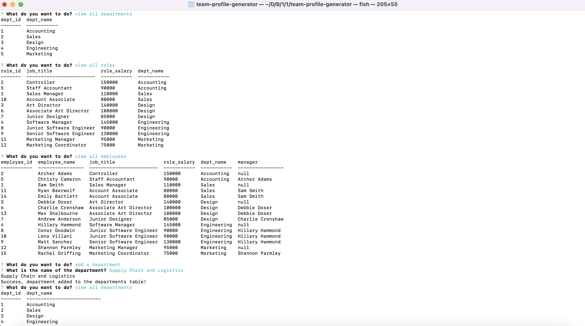

# Employee Tracker CMS

  

  ## Tabel of Countents
  - [Description](#description)
  - [Installation](#installation)
  - [Usage](#usage)
  - [Contributing](#contributing) 
  - [Tests](#tests)
  - [License](#license)
  - [Questions](#questions)
  
  
  ## Description
  This is a command-line application built from scratch to manage a company's employee database, using Node.js, Inquirer, and MySQL. The user can view all departments, view all roles, view all employees, add a department, add a role and update an employee's role and manager.

  View a walkthrough video of the application [here.](https://youtu.be/xYs2ciXqQM4) 

  
  
  ## Installation
  To install, clone the repository to you rlocal machine. Then run npm i to install all dependencies, access the mySQL shell and run the source and seeds files to set up the database. Finally fun node index.js to begin the application. 
  
  ## User Store  
    AS A business owner
    I WANT to be able to view and manage the departments, roles, and employees in my company
    SO THAT I can organize and plan my business

    GIVEN a command-line application that accepts user input
    WHEN I start the application
    THEN I am presented with the following options: view all departments, view all roles, view all employees, add a department, add a role, add an employee, and update an employee role
    WHEN I choose to view all departments
    THEN I am presented with a formatted table showing department names and department ids
    WHEN I choose to view all roles
    THEN I am presented with the job title, role id, the department that role belongs to, and the salary for that role
    WHEN I choose to view all employees
    THEN I am presented with a formatted table showing employee data, including employee ids, first names, last names, job titles, departments, salaries, and managers that the employees report to
    WHEN I choose to add a department
    THEN I am prompted to enter the name of the department and that department is added to the database
    WHEN I choose to add a role
    THEN I am prompted to enter the name, salary, and department for the role and that role is added to the database
    WHEN I choose to add an employee
    THEN I am prompted to enter the employee’s first name, last name, role, and manager, and that employee is added to the database
    WHEN I choose to update an employee role
    THEN I am prompted to select an employee to update and their new role and this information is updated in the database 
    
  ## Contributing 
  To contribute, clone the repository, open a branch to write new code and request it be merged into the main branch.
  
  ## Tests 
  There are no tests for this project.
  
  ## License
    MIT
  
  ## Questions
  - [GitHub profile](https://github.com/millersg47)
  - Contact Me at millersg47@gmail.com with additional questions